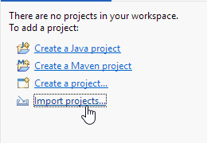
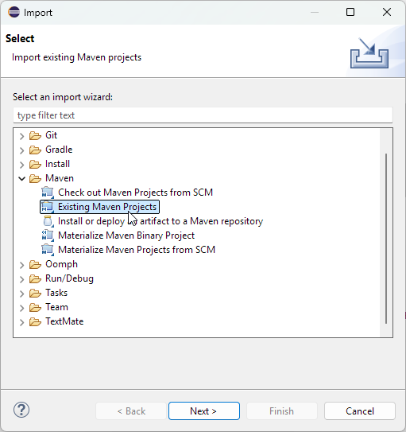
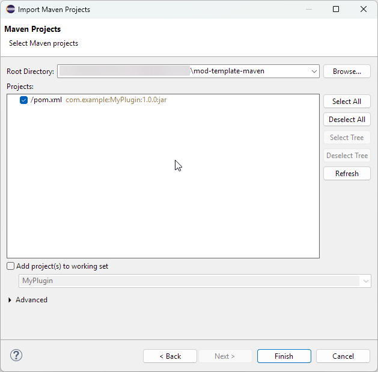
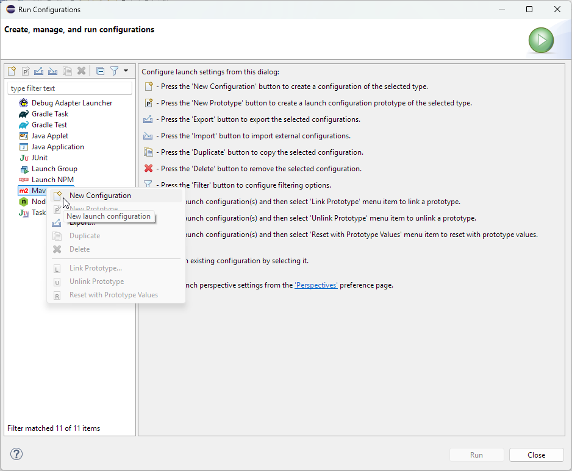
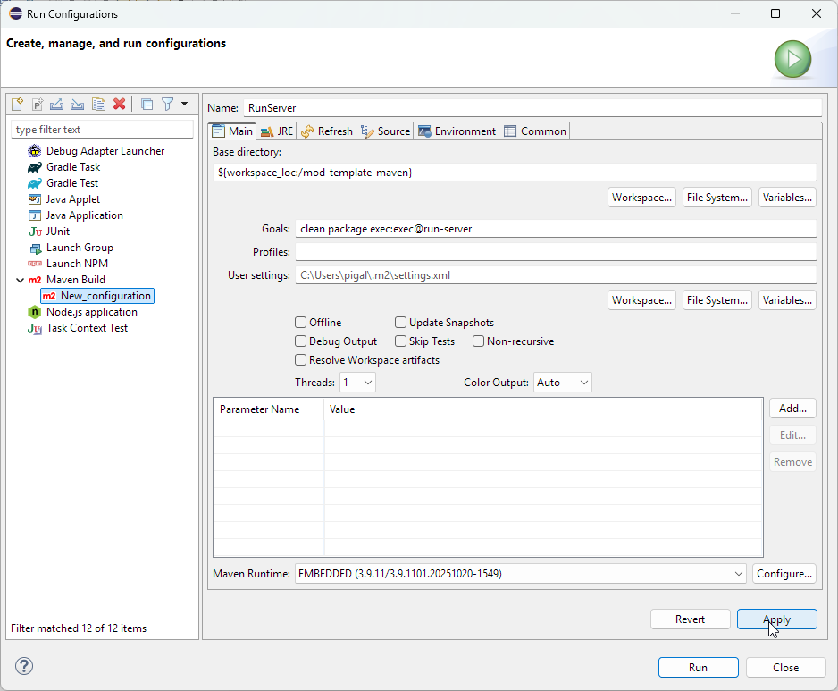
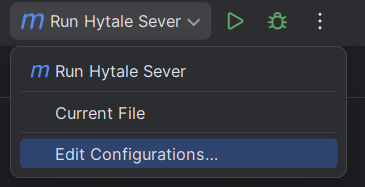
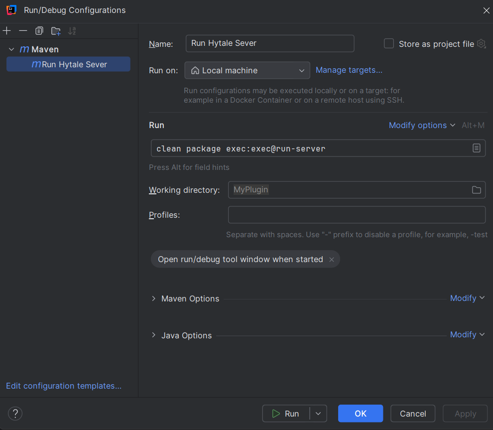

# Hymods / mod-template-maven

A template project for creating Hytale mods using Maven. Copy this repository to get started quickly with your own mod.

## Setup

This project uses Maven to compile and package the mod. We provide `mvnw` and `mvnw.cmd` wrapper scripts so you don't need to have Maven installed globally. You will need to have Java 25 installed, which you can grab from [Adoptium](https://adoptium.net/).

In `src/main/resources/manifest.json` you will see some specifiers for Group, Name, Authors, etc. Group, Name, and Version are populated by Maven at build time from the `pom.xml` file. You can change these values in the `pom.xml` file to suit your mod.

Additionally, you may need to modify `hytale.install-dir` and `hytale.patchline` properties in the `pom.xml` to match your Hytale installation and patchline. By default, these are set to work with a standard Hytale (release) installation on Windows.

## Building

When you are ready to package your mod, ensure that the Main in your manifest is set to your main mod class, then run the following command:

```bash
mvnw clean package
```

(On Unix-based systems, use `./mvnw clean package` after making the script executable with `chmod +x mvnw`).

You will then find your mod JAR file in the `target/final/` directory, ready for distribution. By default, this project is set up to bundle (shade) all dependencies into the final JAR, so you don't need to worry about distributing them separately but you should ensure that you comply with the licenses of any dependencies you include.

### Running a Dev Server

To test your mod in a development environment, you can run a Hytale dev server with your mod loaded using the following command:

```bash
mvnw clean package exec:exec@run-server
```

You will need to authenticate your test server, which you can do by running `auth login device` and following the instructions. Once authenticated, you can run `auth persistience Encrypted` to save your credentials for future runs.

To stop the server, simply type `stop` and hit enter in the console where the server is running.

### IDE Integration

You can also integrate this project with your favorite IDE (such as IntelliJ IDEA, VSCode, or Eclipse) by importing it as a Maven project.

<details>
  <summary>Eclipse IDE</summary>

1. Open Eclipse and click "Import projects..."
   <br />
   

2. Select "Existing Maven Projects" and click "Next".
   <br />
   

3. Browse to the location of this project and select it. Click "Finish".
   <br />
   
   Eclipse will now import the project and download any necessary dependencies.

To add a custom RunServer command:

1. Go to "Run" > "Run Configurations..." and right click on "Maven Build", then select "New Configuration".
   <br />
   

2. Name the configuration "RunServer", set the Base directory to the project location, and set the Goals to `clean package exec:exec@run-server`. Click "Apply" then "Run".
   <br />
   

</details>

<details>
  <summary>IDEA InteliJ</summary>

1. Open InteliJ and select "Open Project" and select your plugin folder.

To add a custom RunServer command:

1. Click the dropdown in the upper right and select "Edit Configurations"
 <br />


2. Click the "+" button and select "Maven" 

3. Name the configuration "RunServer", and set the command to "clean package exec:exec@run-server"
   <br />
   
4. Click save

You can now click the run button in the upper right of the editor to start the server.
</details>


### Authenticating the Dev server
Once the Hytale server is running, you likely won't be able to join it immediately as you need to auth the server.

You can do so by running the following commands in the now-running Hytale server console window in order:

`auth login device` Then click on the second link that has the device code in the url and follow the instructions in your browser.

`auth persistence Encrypted` This tells the hytale server to keep a local copy of your auth between reboots


## Publishing your Mod

You can upload your mod to various Hytale mod hosting platforms, such as [Hymods](https://hymods.io/) or [Curseforge](https://www.curseforge.com/hytale).

## Mod Development

Right now, there is no official documentation for Hytale modding. However, you can refer to this [community-maintained documentation](https://hytalemodding.dev/) to get started with mod development and to learn the basics of Java.
